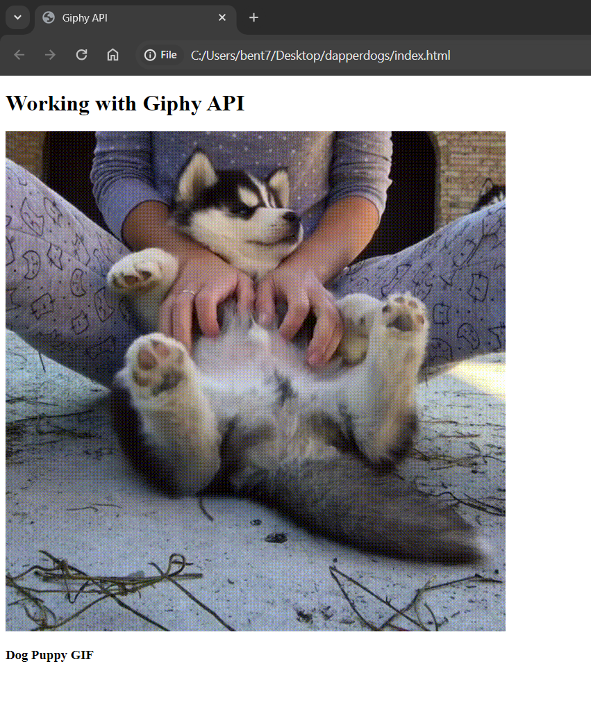

# API-Gifs

With supplemental LinkedIn Learning courses, in addition to oconnecting to APIs and pulling data all from scratch. I decided to take it a step further to see if I could add gifs to an HTML webpage all from scratch. Throughout this mini-project, the steps that I followed included:
1. Making a request to the Giphy API
2. Filtering responses from the API using parameters
3. Learning how to access certain parts of the data in the response
4. And finally, embedding the response data into my HTML webpage.

And because I love dogs, each time this page is refreshed, there is a new dog-related gif everytime!

